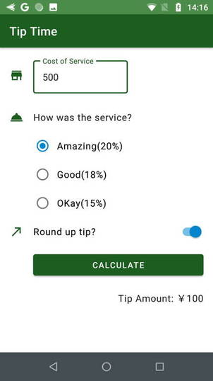
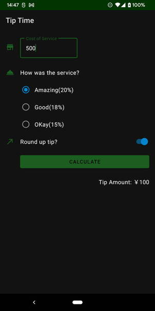

# MyTipTimeApp
サービスに対するチップ計算するアプリです（※Android Kotlin Basic課題アプリ）

## 概要
* チップを計算します。
* このアプリは、下記のコースを学習した備忘録として記録する個人的なモノです。
 https://developer.android.com/courses/android-basics-kotlin/unit-2?hl=ja
  
  * PathWay 1 and  Pathway 2

## スクリーンショット
### ライトモード
  

### ダークモード
  
